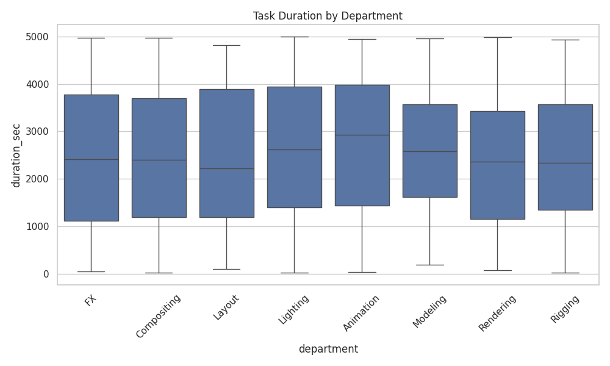
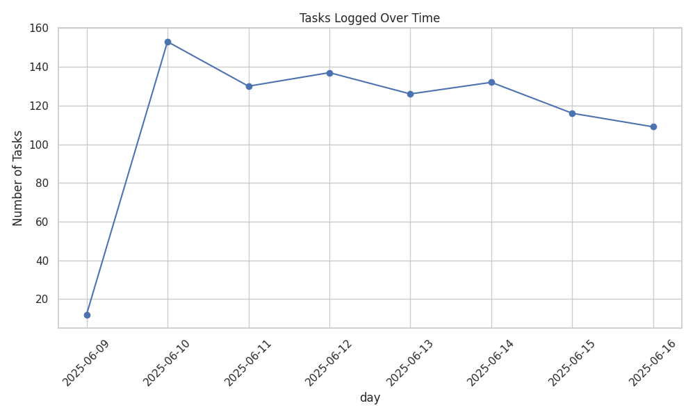
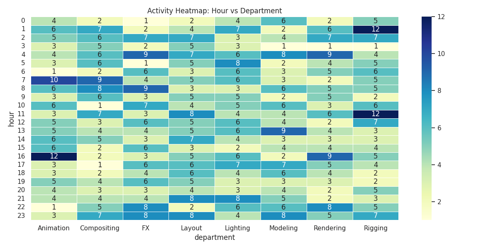

VfxLogAnalytics

This project simulates and analyzes VFX pipeline log data and it includes parameters such as log generation, data validation, feature engineering, statistical summaries, and visualizations to show trends across departments and users.

Contents
This repository contains the sample VFX log dataset with approximately 10% of the data being messy, the analysis file where the data is cleaned and processed, and lastly the exported images and files depicting trends and activity.

Key Features
- Data validation (e.g. bad timestamps, unknown departments)
- Feature engineering (hour of day and error detection)
- Time-series breakdown of task volume
- Activity heatmaps by hour and department
- Exported summary reports and visualizations

Sample plots generated from analysis

Task Duration by Department

Tasks Logged Over Time

Hourly Department Activity Heatmap

